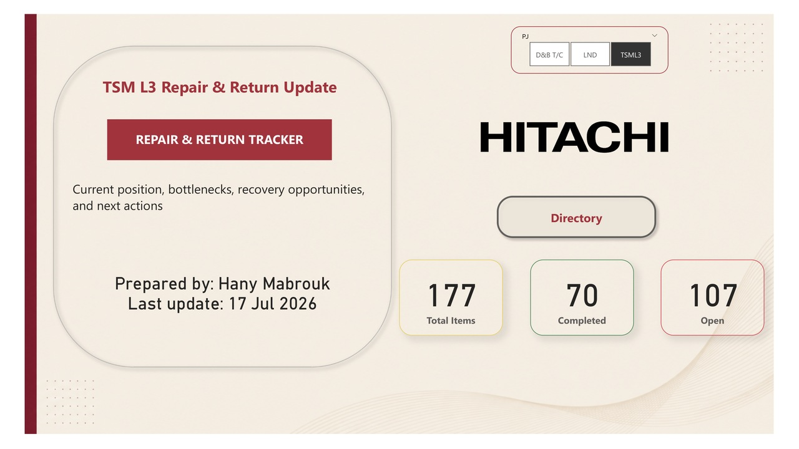

  

<h1 align="center">🔧 Repair & Return Dashboard</h1>

Interactive Power BI Dashboard for Monitoring Repair Operations, Supplier Performance, Inventory Aging, and Repair Cycle Time

---

# 📌 Project Overview
