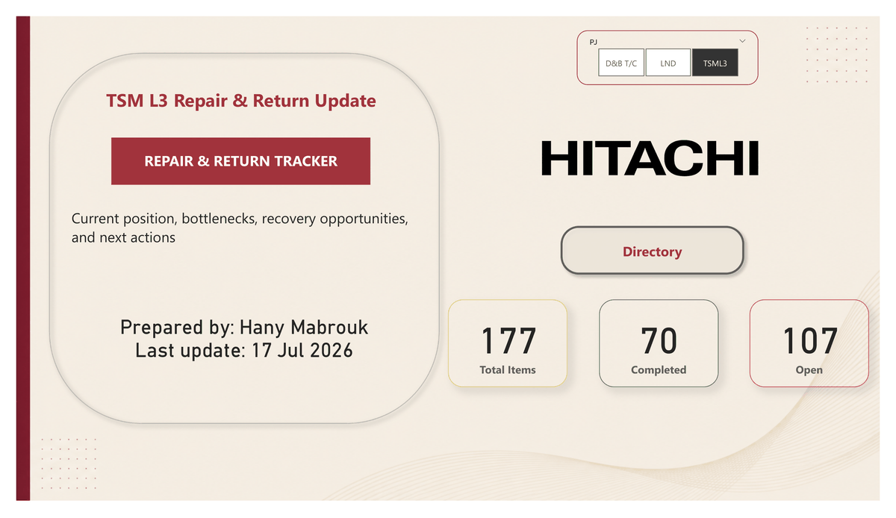
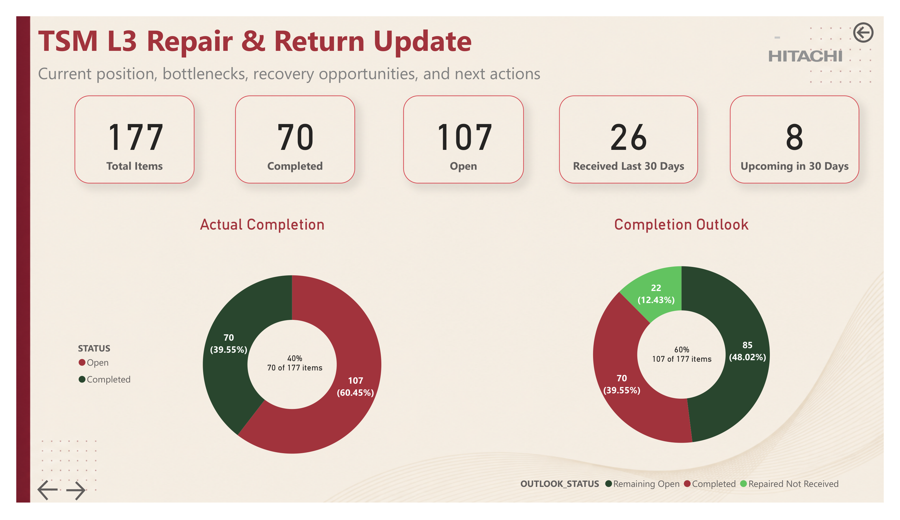
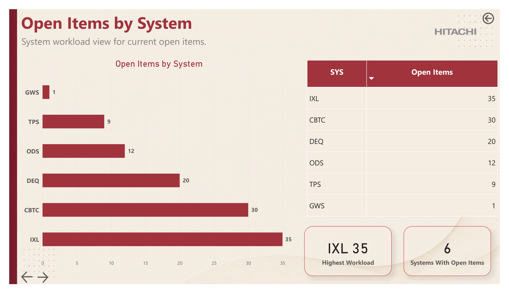
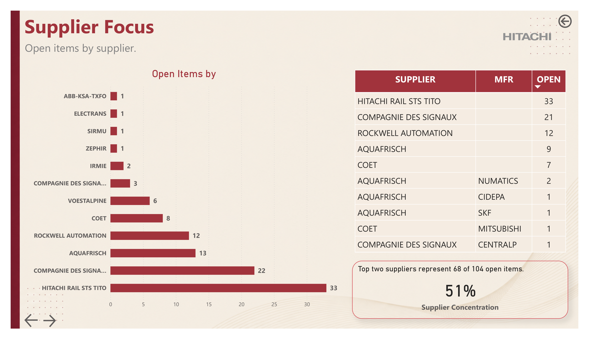
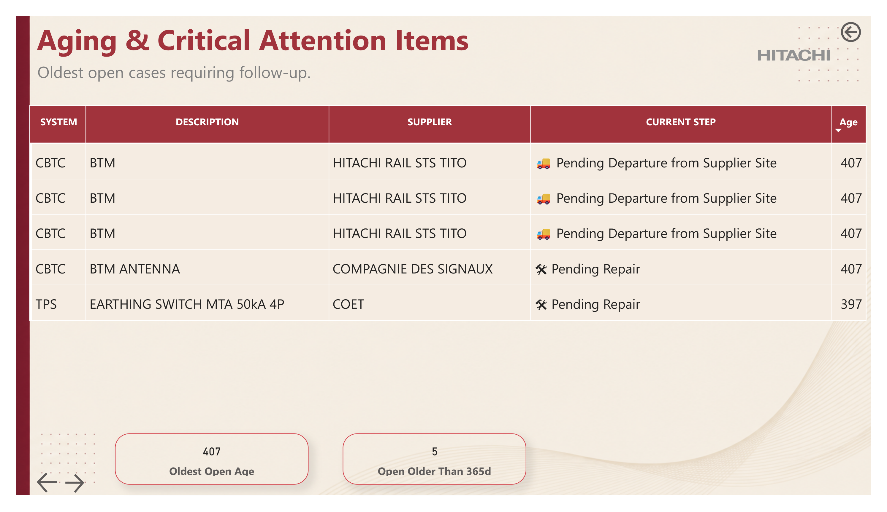
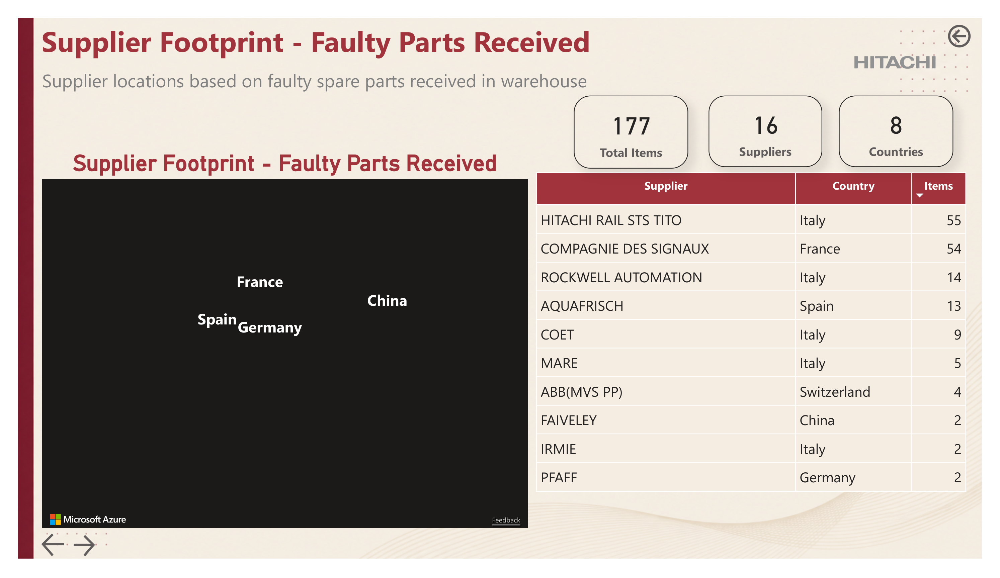
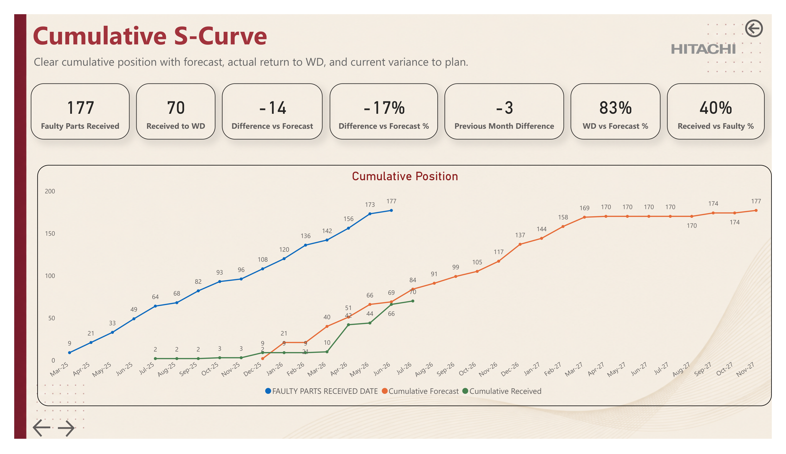
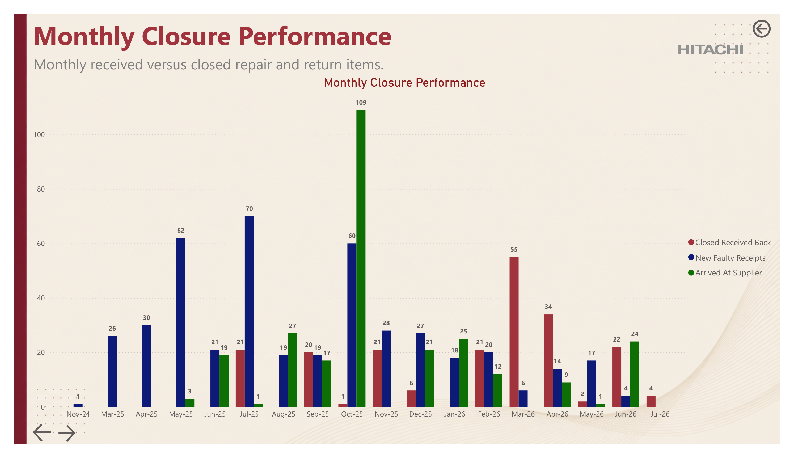
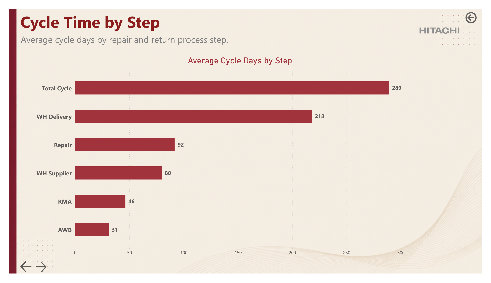

# 🔧 Repair & Return Dashboard

<p align="center">
  
</p>

<p align="center">


</p>

---

# 🎥 Dashboard Preview

<p align="center">

</p>

---

# 📌 Project Overview

The **Repair & Return Dashboard** is an interactive **Power BI** solution developed to monitor the complete repair lifecycle of faulty spare parts.

The dashboard enables stakeholders to track repair progress, identify operational bottlenecks, monitor supplier performance, measure repair cycle time, and support data-driven decision-making.

---

# 🎯 Business Objectives

- Monitor repair progress in real time.
- Track open and completed repair cases.
- Identify operational bottlenecks.
- Analyze supplier performance.
- Monitor repair cycle time.
- Improve warehouse return planning.
- Support management with KPI-driven insights.

---

# 📊 Dashboard Features

- Executive Overview
- Open Items Monitoring
- Supplier Analysis
- Aging Analysis
- Cumulative S-Curve
- Monthly Performance
- Cycle Time Analysis
- Supplier Footprint
- Critical Spare Parts Analysis

---

# 📈 Dashboard Pages

---

## 1️⃣ Current Position & Completion Outlook

Provides an executive overview of repair status, completed items, open workload, recent receipts, and completion outlook.

<p align="center">

</p>

---

## 2️⃣ Open Items by System

Shows the distribution of open repair items across different railway systems.

<p align="center">

</p>

---

## 3️⃣ Supplier Focus

Highlights suppliers with the highest number of open items and measures supplier concentration risk.

<p align="center">

</p>

---

## 4️⃣ Aging & Critical Attention

Displays the oldest repair cases requiring immediate operational follow-up.

<p align="center">

</p>

---

## 5️⃣ Supplier Footprint

Visualizes supplier locations and received faulty spare parts by country.

<p align="center">

</p>

---

## 6️⃣ Cumulative S-Curve

Compares cumulative faulty receipts, forecasted returns, and actual warehouse returns.

<p align="center">

</p>

---

## 7️⃣ Monthly Closure Performance

Tracks monthly faulty receipts, supplier arrivals, and repaired items returned.

<p align="center">

</p>

---

## 8️⃣ Cycle Time by Step

Analyzes average repair cycle duration across every repair stage.

<p align="center">

</p>

---

# 📊 Key KPIs

- Total Faulty Parts
- Completed Repairs
- Open Repairs
- Supplier Performance
- Aging Analysis
- Average Cycle Time
- Warehouse Delivery Time
- Repair Completion Rate
- Forecast vs Actual
- Cumulative Return Progress

---

# 💡 Key Insights

- Monitor repair backlog and completion trends.
- Detect operational bottlenecks early.
- Identify suppliers causing the highest delays.
- Measure repair turnaround performance.
- Improve forecasting accuracy.
- Support proactive operational planning.

---

# 🛠 Tools Used

- Microsoft Power BI
- Power Query
- DAX
- Microsoft Excel

---

# 🧠 Skills Demonstrated

- Data Cleaning
- Data Transformation
- Data Modeling
- DAX Measures
- KPI Design
- Dashboard Development
- Data Visualization
- Supply Chain Analytics
- Process Monitoring
- Business Intelligence

---

# 🚀 Future Improvements

- Power BI Service Deployment
- Automated Refresh
- Row-Level Security (RLS)
- Predictive Analytics
- Drill-through Pages
- Mobile Layout Optimization

---

# 📂 Repository Structure

```text
Repair-and-Return-Dashboard
│
├── README.md
├── repository-cover.jpg
├── dashboard-preview.gif
├── 05-current-position-completion-outlook.png
├── 07-open-items-by-system.png
├── 08-supplier-focus.png
├── 10-aging-critical-attention.png
├── 12-supplier-footprint.png
├── 13-cumulative-s-curve.png
├── 14-monthly-closure-performance.png
├── 15-cycle-time-by-step.png
├── Dashboard.pdf
└── Repair & Return Dashboard.pbix
```

---

# ⭐ If you found this project helpful, don't forget to Star the repository!
